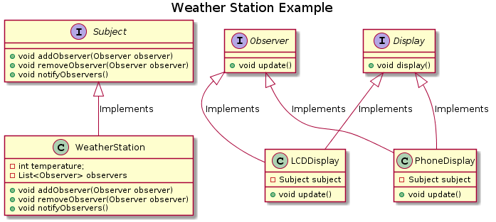

# Weather Station Example

The UML diagram for the example cam be found below - 

<p align="center"></p>

## Important points

Some of the key points present in this example is as follows - 

1.  The ```WeatherStation class``` contains a collection of all the observers. 
1.  The constructor of the ConcreteObserver is created in such a way that the observer is automatically added to the list of the observers present with the WeatherStation. 