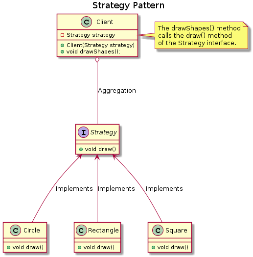

# Shapes Example

This is another example for the strategy pattern. 

The UML for the example is shown below - 

<p align="center"></p>

Here the ```Client``` class contains the ```Strategy``` interface which is used to provide different implementations for the draw method during object instantiation. 