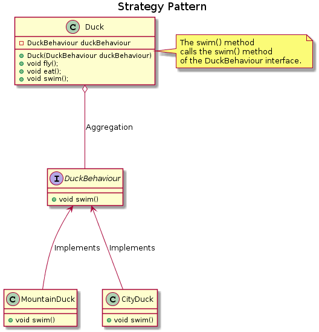

# Duck Exmaple

This is another example for the Strategy pattern. 

<p align="center"></p>

Here we are able to provide different implementations for the ```swim()``` method of the ```Duck class``` by making use of an interface for its behaviour. This way we are able to create different instances of the Duck class with different implementations of the swim method. 

The implementation for the swim method is provided through the constructor during object instantiation. This can be seen in ```Main.java``` file. 