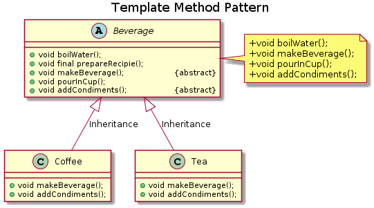

# Beverage Example

This is an example for the Template Pattern. Here, we have an abstract class that contains methods which can have different concrete implementations. 

In this case we have two abstract methods which are - 

1.  ```makeBeverage();```
1.  ```addCondiments();```

These two methods have different implementations in their concrete classes (i.e. ```Coffee``` and ```Tea```).

Both the concrete classes do not override the template method. They implement the abstract method present inside template method. 

This ensures that the overall structure of the program doesn't change.

The ```UML``` diagram can be shown below - 

<p align="center"></p>


The template method in this case is the ```prepareRecipie()``` method. 

On executing the main method, you'll notice that for different classes the template method shows different results without the template method being modified itself. 

In the whole process the template method was not modified by its child classes.
