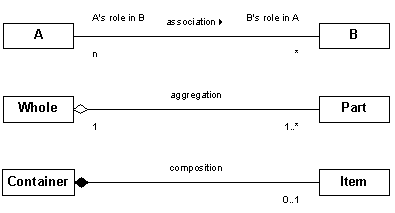

# Association vs Aggregation vs Composition

The aim of this post is to provide a clear explanation on ```association```, ```composition``` and ```aggregation``` with code snippets and UML diagrams.

## Definition

Here are their definitions - 

1.  **Association** :

    Association is a connection between between one object to another in way that one uses the services offered by the other object.
    
    :warning: Association can be ```one-to-one, one-to-many, many-to-one, many-to-many```.

    :boom: ```Aggregation``` and ```Composition``` are the forms of association.

1.  **Composition** :

    Composition is a strong connection between two objects where one object **owns** the other object. The objects are strongly linked with each other and when the parent object ceases to exist, the child object will also cease to exist. 

    Also, it can be said that in composition, one object is a **part-of** another object.

    Some examples are as follows - 

    1.  A human body and its organs. Here, the organs are a **part-of** the human body. And also the human body **owns** its organs.
    1.  A car and its components. The components of a car are **part-of** the car. 

    In both the above mentioned cases, the other object will cease to exist without the other object.

1.  **Aggregation** :

    Aggregation is a weak connection between objects where an object can exist when the other object ceases to exist. Here, an object **uses** the other object. 

    Also, the relationship between the objects is **has-a**. 

    Some examples are as follows - 

    1.  The relationship between an organisation and its employees. Here the organisation **uses** its employees. 
    1.  A schools and its students also come under aggregation. 

## Representation in code

```Composition``` can be represented by including the ```final``` keyword in ```Java```.

Here is a sample code snippet - 

```java
public class HumanBody {
    final private Heart heart;
    final private Brain brain;

    public HumanBody() {
        heart = new Heart();
        brain = new Brain();
    }
}

class Heart {
    public void heartBeat() {
        System.out.println("Lub-dub");
    }
}

class Brain {
    public void think() {
        System.out.println("Thinking");
    }
}
```

:warning: The ```final``` keyword is used to make sure that the other object(s) are initialized when the object is created. 

```Association``` on the other hand can be implemented by not using the ```final``` keyword.

## UML Representation 

The ```UML``` representation for all of these can be found below - 

<p align="center"></p>

Also, the below image shows the relationship between association, aggregation and composition. 

<p align="center"></p>